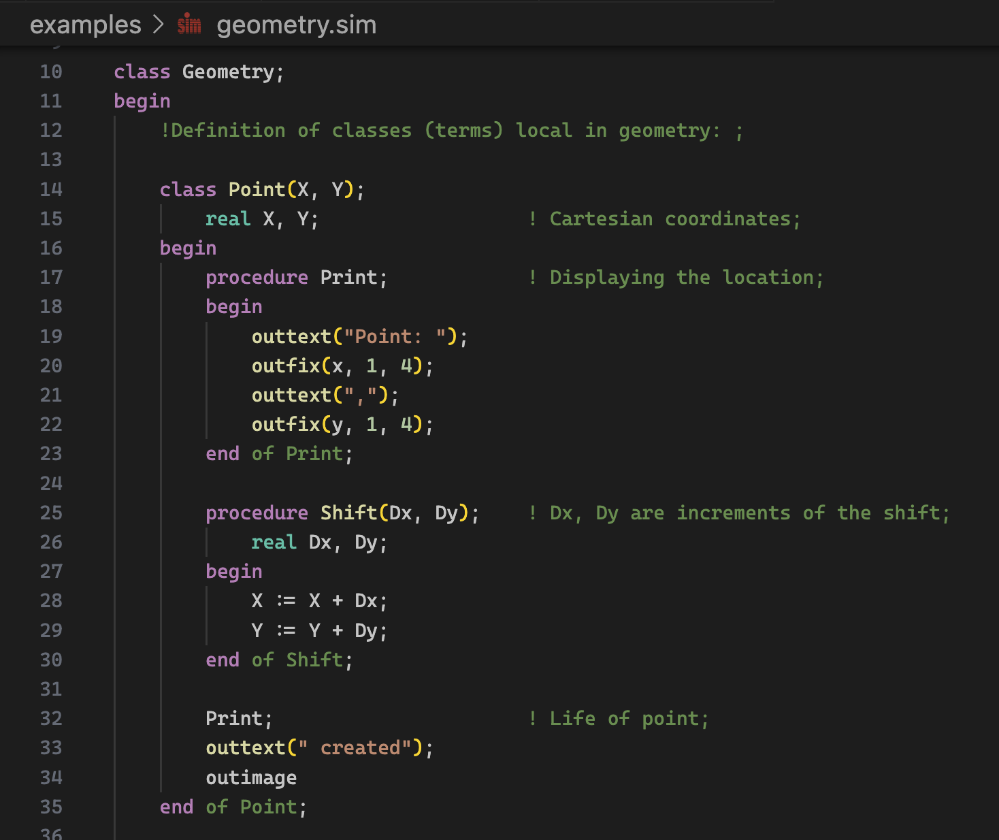

# Simula extension for Visual Studio Code

[Simula](https://en.wikipedia.org/wiki/Simula) is a historical programming
language, famous for being the first language to introduce object-oriented programming.

## Features

This extension adds syntax highlighting on all .sim files, and if you
right-click a file and choose "Run Simula File in Terminal", it will
compile the program with GNU cim, and execute the result.

## Requirements

In order to run Simula files with this extension, you need the GNU Cim
compiler installed.

## Known Issues

The language grammar isn't perfect.
It recognizes `MyFunctionCall(something);` with paranthesis as a function,
but not `MyFunctionCall;` without paranthesis.
